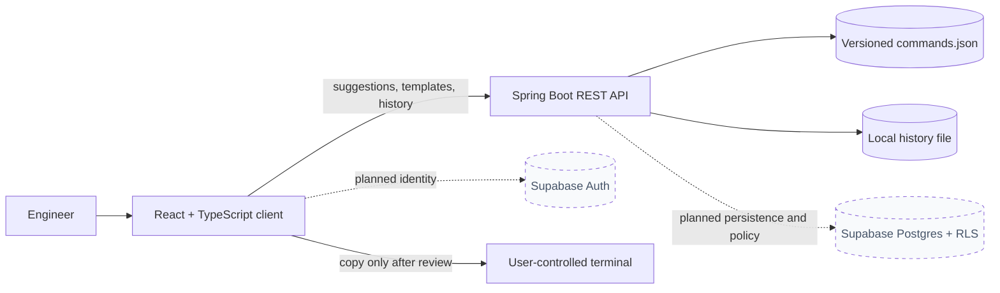

# Architecture and trust boundaries

SmartCLI keeps command authoring separate from command execution. The current implementation is intentionally small, with replaceable identity and persistence boundaries for the planned Supabase integration.

## Responsibilities

| Boundary | Owns today | Does not own |
|---|---|---|
| React client | Search, guided inputs, preview, saved-command UX, themes | Shell execution, infrastructure access |
| Spring Boot API | Catalog lookup, placeholder metadata, local history API | Authentication, cloud authorization, remote execution |
| `commands.json` | Reviewable templates, categories, descriptions | Credentials, environment-specific secrets |
| Local persistence | Development command history | Shared workspaces or production identity |
| Demo build | Clearly labeled design previews and fixtures | Production capabilities |

## Production versus preview

`npm run build` creates the production bundle and omits preview-only routes, mock identities, scenario controls, and fixture data. `npm run build:demo` intentionally includes those design previews for product evaluation. The production integrity script scans the output to prevent preview language and fixture identities from leaking into a release bundle.

## Planned Supabase boundary

Supabase will replace—not sit beside—the temporary local identity and persistence assumptions. Authenticated user identity will originate from Supabase Auth. Workspace membership and roles will be enforced by database policies, not only hidden UI controls. Until that integration lands, previews of auth and RBAC remain development-only and are not claims about security.

## Non-goals

SmartCLI does not execute shell commands, open SSH sessions, access Kubernetes clusters, ingest private keys, or act as an infrastructure control plane. A generated command always crosses a human review and copy boundary before it can reach a terminal.
